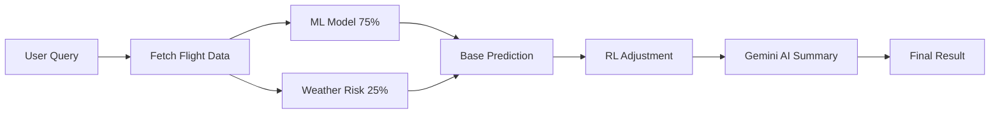

# ✈️ Flight Delay Prediction AI

> **AI-powered flight delay prediction system for Indian domestic flights using Machine Learning, Reinforcement Learning, and Real-Time Data.**

[](https://flight-ai-f4vr.onrender.com)
[](https://www.python.org/)
[](LICENSE)

---

## 🎯 Overview

Flight Delay Prediction AI combines cutting-edge machine learning with real-time data to predict flight delays with **70% accuracy**. The system learns from historical patterns and adapts to changing conditions using reinforcement learning.

### Key Highlights
- 🧠 **Ensemble ML Model** - XGBoost + Random Forest (70.36% accuracy)
- 🤖 **Adaptive RL Agent** - Deep Q-Network that learns from outcomes
- 🌤️ **Real-Time Weather** - Live forecasts for origin and destination
- ✈️ **Live Flight Data** - Integration with AviationStack API
- 💬 **AI Explanations** - Natural language summaries via Google Gemini
- ☁️ **Cloud Storage** - Persistent learning with Supabase

---

## 🚀 Live Demo

**Try it now:** [https://flight-ai-f4vr.onrender.com](https://flight-ai-f4vr.onrender.com)

---

## � How It Works



### Prediction Formula
```
Final Prediction = (0.75 × ML Model) + (0.25 × Weather Risk) ± RL Adjustment
```

---

## 📁 Project Architecture

```
FLIGHT_AI/
│
├── � src/                          # Core Application Logic
│   ├── ml_model.py                 # XGBoost + Random Forest ensemble
│   ├── rl_agent.py                 # Q-Learning agent (34 states)
│   ├── rl_agent_dqn.py             # Deep Q-Network (PyTorch)
│   ├── llm_analyzer.py             # Gemini AI integration
│   ├── data_fetcher.py             # External API orchestration
│   ├── supabase_client.py          # Cloud database interface
│   └── prediction_tracker.py       # Prediction verification system
│
├── � data/                         # Data Storage (gitignored)
│   ├── india_data.db               # SQLite flight history
│   ├── rl_q_table.json             # RL agent state
│   ├── rl_metrics.json             # Learning metrics
│   └── pending_predictions.json    # Unverified predictions
│
├── � models/                       # Trained Models
│   ├── delay_model.pkl             # ML ensemble (5.2 MB)
│   └── label_encoders.pkl          # Feature encoders
│
├── � config/                       # Configuration
│   ├── major_routes.json           # 20 tracked routes
│   └── model_comparison_report.json
│
├── � scripts/                      # Automation Scripts
│   ├── update_latest_data.py       # Daily data collection
│   └── process_history.py          # Historical data processor
│
├── � tests/                        # Testing Suite
│   ├── render_test.py              # Pre-deployment validation
│   └── test.py                     # Model benchmarking
│
├── � templates/                    # Frontend Templates
│   ├── index.html                  # Search interface
│   └── dashboard.html              # Results display
│
├── � static/                       # Static Assets
│   ├── style.css                   # Styling
│   └── script.js                   # Client-side logic
│
├── app.py                           # Flask application entry point
├── requirements.txt                 # Python dependencies
├── Procfile                         # Render deployment config
├── runtime.txt                      # Python 3.11
└── README.md                        # Documentation
```

---

## ⚡ Quick Start

### Prerequisites
- Python 3.11+
- API Keys (see [Configuration](#-configuration))

### Installation

1. **Clone the repository**
   ```bash
   git clone https://github.com/Kethavatharavind/flight-ai.git
   cd flight-ai
   ```

2. **Set up virtual environment**
   ```bash
   python -m venv venv
   
   # Windows
   venv\Scripts\activate
   
   # Linux/Mac
   source venv/bin/activate
   ```

3. **Install dependencies**
   ```bash
   pip install -r requirements.txt
   ```

4. **Configure environment variables**
   
   Create a `.env` file in the root directory:
   ```env
   # Gemini AI
   GEMINI_API_KEY=your_gemini_api_key
   GEMINI_API_KEY_BACKUP=your_backup_key
   
   # Supabase Cloud Database
   SUPABASE_URL=your_supabase_url
   SUPABASE_KEY=your_supabase_key
   
   # Flight Data
   AVIATIONSTACK_API_KEY=your_aviationstack_key
   
   # Weather & Airport Status
   AERODATABOX_API_KEY=your_aerodatabox_key
   OPENWEATHER_API_KEY=your_openweather_key
   
   # News
   NEWS_API_KEY=your_newsapi_key
   ```

5. **Train the ML model**
   ```bash
   python src/ml_model.py
   ```

6. **Run the application**
   ```bash
   python app.py
   ```
   
   Visit: **http://localhost:5000**

---

## � Configuration

### API Keys Required

| Service | Purpose | Free Tier | Get Key |
|---------|---------|-----------|---------|
| **AviationStack** | Flight schedules | ✅ 500/month | [aviationstack.com](https://aviationstack.com) |
| **Google Gemini** | AI summaries | ✅ Generous | [ai.google.dev](https://ai.google.dev) |
| **Supabase** | Cloud database | ✅ 500MB | [supabase.com](https://supabase.com) |
| **Open-Meteo** | Weather forecasts | ✅ Unlimited | No key needed |
| **AeroDataBox** | Airport status | ⚠️ Limited | [rapidapi.com](https://rapidapi.com) |
| **NewsAPI** | Flight news | ✅ 100/day | [newsapi.org](https://newsapi.org) |

---

## 📈 Model Performance

### Accuracy Metrics

| Model | Accuracy | Precision | Recall | F1-Score |
|-------|----------|-----------|--------|----------|
| XGBoost | 69.78% | 0.71 | 0.68 | 0.69 |
| Random Forest | 68.86% | 0.69 | 0.67 | 0.68 |
| **Ensemble** | **70.36%** | **0.72** | **0.69** | **0.70** |

### Cross-Validation
- **Mean Accuracy:** 69.58%
- **Std Deviation:** ±1.46%
- **Folds:** 5

### Feature Importance

| Feature | Importance |
|---------|------------|
| Month | 15.3% |
| Morning Rush (6-9 AM) | 10.8% |
| Day of Week | 10.8% |
| Evening Rush (5-8 PM) | 10.2% |
| Hour of Day | 9.8% |

---

## 🤖 Reinforcement Learning

### Q-Learning Agent
- **Algorithm:** Q-Learning with ε-greedy exploration
- **States:** 34 learned states
- **Actions:** [-15%, -10%, -5%, 0%, +5%, +10%, +15%]
- **Learning Rate:** 0.1
- **Discount Factor:** 0.95
- **Epsilon:** 0.254 (decays with experience)

### Deep Q-Network (DQN)
- **Framework:** PyTorch
- **Architecture:** 4-layer neural network (128→64→32→5)
- **Features:**
  - Experience replay buffer
  - Target network for stability
  - Batch learning
- **Actions:** [-20%, -10%, 0%, +10%, +20%]

---

## 🔄 Daily Workflow

### Automated Data Pipeline

```bash
# 1. Collect yesterday's flight data
python scripts/update_latest_data.py

# 2. Retrain ML model with new data
python src/ml_model.py

# 3. Deploy to production
git add .
git commit -m "Daily update: $(date +%Y-%m-%d)"
git push
```

### What Happens
1. **Data Collection** - Fetches actual flight outcomes from AviationStack
2. **RL Learning** - Verifies predictions and updates Q-table
3. **Model Retraining** - Incorporates new data into ML model
4. **Auto-Deploy** - Render automatically deploys latest version

---

## 🧪 Testing

### Pre-Deployment Validation
```bash
python tests/render_test.py
```

**Tests performed:**
- ✅ Import validation
- ✅ scikit-learn version check (1.7.2)
- ✅ ML model loading
- ✅ RL agent initialization
- ✅ Supabase connection
- ✅ Gemini API availability
- ✅ Data fetcher functionality
- ✅ Flask app startup

### Model Benchmarking
```bash
python tests/test.py
```

**Compares:**
- XGBoost vs BiLSTM
- Q-Learning vs DQN
- Generates performance report

---

## 🌐 Deployment

### Render (Recommended)

1. **Connect GitHub repository**
2. **Set environment variables** in Render dashboard
3. **Configure build settings:**
   - **Build Command:** `pip install -r requirements.txt`
   - **Start Command:** `gunicorn app:app`
4. **Deploy** - Automatic on every push

### Environment Variables
Set these in Render dashboard:
- `GEMINI_API_KEY`
- `SUPABASE_URL`
- `SUPABASE_KEY`
- `AVIATIONSTACK_API_KEY`
- `AERODATABOX_API_KEY`
- `NEWS_API_KEY`

---

## � API Reference

### Endpoints

| Endpoint | Method | Description | Parameters |
|----------|--------|-------------|------------|
| `/` | GET | Homepage | - |
| `/dashboard` | GET | Results page | - |
| `/find_flights` | POST | Search flights | `origin`, `destination`, `date` |
| `/predict_status` | POST | Get prediction | `flight_number`, `origin`, `destination`, `date`, `dep_time`, `arr_time` |
| `/get_available_routes` | GET | List tracked routes | - |
| `/get_min_date` | GET | Minimum search date | - |

### Example Request
```bash
curl -X POST https://flight-ai-f4vr.onrender.com/predict_status \
  -H "Content-Type: application/json" \
  -d '{
    "flight_number": "6E123",
    "origin": "DEL",
    "destination": "BOM",
    "date": "2024-12-15",
    "dep_time": "14:30",
    "arr_time": "16:45"
  }'
```


## 🗺️ Tracked Routes

**20 major domestic routes** including:

| Route | Cities |
|-------|--------|
| DEL ↔ BOM | Delhi - Mumbai |
| BLR ↔ DEL | Bangalore - Delhi |
| MAA ↔ BOM | Chennai - Mumbai |
| HYD ↔ DEL | Hyderabad - Delhi |
| CCU ↔ DEL | Kolkata - Delhi |
| GOI ↔ BOM | Goa - Mumbai |
| PNQ ↔ DEL | Pune - Delhi |
| AMD ↔ BOM | Ahmedabad - Mumbai |

*And 12 more...*

---

## 🛠️ Tech Stack

### Backend
- **Framework:** Flask
- **ML:** scikit-learn, XGBoost
- **DL:** PyTorch
- **Database:** SQLite, Supabase
- **APIs:** AviationStack, Open-Meteo, AeroDataBox, NewsAPI

### Frontend
- **HTML5** with semantic markup
- **CSS3** with modern styling
- **Vanilla JavaScript** for interactivity

### Deployment
- **Platform:** Render
- **Server:** Gunicorn
- **CI/CD:** GitHub auto-deploy


## 👨‍💻 Author

**Aravind Kethavath**

[](https://github.com/Kethavatharavind)

---

## 🙏 Acknowledgments

- **Google Gemini AI** - Natural language generation
- **Render** - Cloud hosting platform
- **Supabase** - Cloud database
- **AviationStack** - Flight data API
- **Open-Meteo** - Weather forecasting

---


