# ✈️ Flight Delay Prediction AI

> **AI-powered flight delay prediction using Machine Learning, Reinforcement Learning, and Real-Time Weather Data**

[](https://flight-ai-f4vr.onrender.com)
[](https://www.python.org/)
[](https://xgboost.readthedocs.io/)

---

## 📊 Overview

Flight delay prediction system that combines:
- **XGBoost + LSTM Hybrid Model** (87% accuracy)
- **Q-Learning RL Agent** (learns from outcomes)
- **Real-time Weather Data** (precipitation, wind, temperature)
- **Large Language Model** (natural language explanations)

**Prediction Window**: 8-180 days before flight  
**Coverage**: 20 major Indian domestic routes

---

## 🏗️ System Architecture

### Complete System Diagram

```mermaid
graph TB
    subgraph "Frontend Layer"
        UI[🖥️ Web Interface<br/>HTML/CSS/JS]
    end
    
    subgraph "Application Layer"
        Flask[⚙️ Flask App<br/>app.py]
        Router[🔀 API Routes]
    end
    
    subgraph "Business Logic"
        Fetcher[📡 Data Fetcher<br/>data_fetcher.py]
        MLModel[🧠 ML Model<br/>ml_model.py]
        RLAgent[🤖 RL Agent<br/>rl_agent.py]
        LLM[💬 LLM Analyzer<br/>llm_analyzer.py]
        Tracker[📝 Prediction Tracker<br/>prediction_tracker.py]
    end
    
    subgraph "External APIs"
        Aviation[✈️ AviationStack<br/>Flight Schedules]
        Weather[🌤️ Open-Meteo<br/>Weather Forecasts]
        News[📰 NewsAPI<br/>Aviation News]
        Gemini[🤖 Google Gemini<br/>AI Summaries]
    end
    
    subgraph "Data Storage"
        SQLite[(💾 SQLite<br/>india_data.db)]
        Models[📦 ML Models<br/>delay_model.pkl]
        RLState[📊 RL Q-Table<br/>q_table.json]
        Supabase[(☁️ Supabase<br/>Cloud Backup)]
    end
    
    UI --> Router
    Router --> Flask
    Flask --> Fetcher
    Flask --> MLModel
    Flask --> RLAgent
    Flask --> LLM
    Flask --> Tracker
    
    Fetcher --> Aviation
    Fetcher --> Weather
    Fetcher --> News
    LLM --> Gemini
    
    MLModel --> Models
    MLModel --> SQLite
    RLAgent --> RLState
    RLAgent --> Supabase
    Tracker --> SQLite
    
    style UI fill:#4CAF50,color:#fff
    style MLModel fill:#FF9800,color:#fff
    style RLAgent fill:#9C27B0,color:#fff
    style Gemini fill:#F44336,color:#fff
```



### Architecture Explanation

**3-Layer Design:**

1. **Frontend Layer**
   - Single-page web interface
   - Client-side JavaScript for API calls
   - No framework dependencies (vanilla JS)

2. **Application Layer**
   - **Flask** serves HTTP requests
   - **API Router** directs requests to appropriate handlers
   - RESTful endpoint design

3. **Business Logic Layer**
   - **Data Fetcher**: Orchestrates all external API calls
   - **ML Model**: XGBoost classifier for delay prediction
   - **RL Agent**: Q-Learning agent for prediction adjustments
   - **LLM Analyzer**: Gemini AI for human-readable summaries
   - **Prediction Tracker**: Stores and verifies predictions

**Data Storage:**
- **SQLite**: Local flight history database (6.7 MB)
- **Trained Models**: Pickled ML models (5 MB)
- **RL Q-Table**: JSON file with learned state-action values (11 KB)
- **Supabase**: Cloud backup for RL agent persistence

---

## 🔄 Data Flow

### Request-Response Flow

```mermaid
sequenceDiagram
    participant User
    participant Frontend
    participant Flask
    participant DataFetcher
    participant MLModel
    participant RLAgent
    participant Gemini
    
    User->>Frontend: Enter flight details<br/>(origin, dest, date)
    Frontend->>Flask: POST /predict_status
    
    Note over Flask: Validate inputs
    
    Flask->>DataFetcher: get_prediction_signals()
    
    DataFetcher->>DataFetcher: Fetch weather forecast<br/>(Open-Meteo API)
    DataFetcher->>DataFetcher: Get historical stats<br/>(SQLite query)
    DataFetcher->>DataFetcher: Fetch airport news<br/>(NewsAPI)
    DataFetcher->>Flask: Return signals dict
    
    Flask->>MLModel: predict_delay_probability()
    MLModel->>MLModel: Extract features<br/>(hour, day, route, weather)
    MLModel->>MLModel: Scale features
    MLModel->>MLModel: XGBoost prediction
    MLModel->>Flask: Base probability (e.g., 35%)
    
    Flask->>RLAgent: apply_adjustment()
    RLAgent->>RLAgent: Hash current state
    RLAgent->>RLAgent: Lookup Q-table
    RLAgent->>RLAgent: Select action (ε-greedy)
    RLAgent->>Flask: Adjusted probability (e.g., 42%)
    
    Flask->>Gemini: predict_flight_outcome()
    Gemini->>Gemini: Build prompt with signals
    Gemini->>Gemini: Generate AI summary
    Gemini->>Flask: Natural language explanation
    
    Flask->>Frontend: JSON response<br/>(probability + summary)
    Frontend->>User: Display prediction
```



### Data Flow Explanation

**Step-by-Step Breakdown:**

1. **User Input** → Frontend captures flight details
2. **API Request** → Frontend sends POST to `/predict_status`
3. **Signal Collection** → `DataFetcher` gathers:
   - Weather forecast (temp, precipitation, wind) from Open-Meteo
   - Historical delay rate for this route from SQLite
   - Recent news about airline/airports from NewsAPI
4. **Feature Engineering** → `MLModel` creates:
   - Time features: hour, day of week, month
   - Route features: origin, destination, historical delay rate
   - Weather features: precipitation probability, wind speed
5. **ML Prediction** → XGBoost processes features → base probability
6. **RL Adjustment** → Q-Learning agent:
   - Creates state hash from signals
   - Looks up learned adjustment in Q-table
   - Applies adjustment (-15% to +15%)
7. **LLM Summary** → Gemini AI generates human explanation
8. **Response** → JSON sent to frontend with probability + explanation

---

## ⚙️ Prediction Pipeline

### How Prediction Works


### Pipeline Explanation

**1. Signal Collection**
- **Weather Signals**:
  - Origin weather: temperature, precipitation %, wind speed
  - Destination weather: same metrics
  - Forecast for departure time
- **Historical Signals**:
  - Route delay rate (e.g., DEL→BOM delayed 35% of time)
  - Airline performance on this route
  - Seasonal patterns
- **Operational Signals**:
  - Time of day (morning rush vs off-peak)
  - Day of week (weekday vs weekend)
  - Airport status/news

**2. Feature Engineering**
```python
features = [
    origin_encoded,           # Airport code → numeric
    destination_encoded,      # Airport code → numeric
    airline_encoded,          # Airline → numeric
    hour_of_day,             # 0-23
    day_of_week,             # 0-6 (Monday=0)
    month,                   # 1-12
    is_weekend,              # 0 or 1
    is_morning_rush,         # 1 if 6-9 AM
    is_evening_rush,         # 1 if 5-8 PM
    route_delay_history,     # Historical % (0-100)
    origin_temp,             # Celsius
    origin_precip_prob,      # 0-100%
    origin_wind_kph,         # km/h
    dest_temp,               # Celsius
    dest_precip_prob,        # 0-100%
    dest_wind_kph            # km/h
]
```

**3. Hybrid ML Prediction (XGBoost + LSTM)**
- **XGBoost Model**:
  - Tree-based ensemble
  - Handles tabular features well
  - Weight: 60%
- **LSTM Model**:
  - Captures temporal patterns
  - Sequential flight data
  - Weight: 40%
- **Ensemble**: Weighted average of both models
- **Combined Accuracy**: 87%

**4. RL Adjustment**
```python
state = hash(origin, dest, hour, weather_conditions)
action = Q_table[state]  # Learned adjustment
final_prob = base_prob + action  # e.g., 35% + 7% = 42%
```

**5. AI Summary**
Gemini AI receives:
- All signals
- ML probability
- Final adjusted probability

Generates natural language explanation of risk factors.

---

## 🔄 Learning Workflow

### Daily Update Process

```mermaid
graph TD
    Start[🕐 Cron Job<br/>Daily 2 AM] --> Fetch[📥 Fetch Yesterday's<br/>Flight Outcomes]
    
    Fetch --> Query[Query AviationStack<br/>for actual delays]
    Query --> Store[💾 Store in SQLite<br/>india_data.db]
    
    Store --> Verify[✅ Verify Previous<br/>Predictions]
    
    Verify --> Compare{Compare<br/>Predicted vs Actual}
    
    Compare -->|Correct| Reward[🎁 Positive Reward<br/>+10 to +50]
    Compare -->|Wrong| Penalty[⚠️ Negative Reward<br/>-50 to -10]
    
    Reward --> UpdateQ[Update Q-Table<br/>Q(s,a) += α·reward]
    Penalty --> UpdateQ
    
    UpdateQ --> SaveRL[💾 Save RL State<br/>q_table.json]
    SaveRL --> CloudSync[☁️ Sync to Supabase]
    
    CloudSync --> Archive[📦 Archive Old Data<br/>Keep 180 days]
    Archive --> End[✅ Complete]
    
    style Start fill:#4CAF50,color:#fff
    style UpdateQ fill:#9C27B0,color:#fff
    style End fill:#2196F3,color:#fff
```

### Learning Process Explanation

**1. Data Collection (Daily)**
```bash
python scripts/update_latest_data.py
```
- Fetches yesterday's actual flight outcomes from AviationStack
- For each flight: actual departure time, arrival time, delay minutes, status
- Stores in SQLite with weather data enrichment

**2. Prediction Verification**
```python
# For each prediction made yesterday:
predicted_delayed = prediction['probability'] > 50
actual_delayed = flight['status'] in ['delayed', 'cancelled']

if predicted_delayed == actual_delayed:
    reward = +10 to +50  # Based on confidence
else:
    reward = -50 to -10  # Penalty for wrong prediction
```

**3. Q-Learning Update**
```python
# Update Q-table
state = hash(origin, dest, hour, weather)
action = selected_adjustment  # e.g., +7%

Q[state][action] += learning_rate * (
    reward + 
    discount_factor * max(Q[next_state]) - 
    Q[state][action]
)
```

**4. Persistence**
- Save Q-table to local JSON (11 KB)
- Sync to Supabase for cloud backup
- Archive flights older than 180 days

---

## 📁 Project Structure

```
FLIGHT_AI/
│
├── src/                          # Core Logic
│   ├── ml_model.py               # XGBoost model (85% accuracy)
│   ├── rl_agent.py               # Q-Learning (42 states learned)
│   ├── llm_analyzer.py           # Gemini AI integration
│   ├── data_fetcher.py           # API orchestration
│   ├── supabase_client.py        # Cloud database
│   └── prediction_tracker.py     # Prediction verification
│
├── data/                         # Storage (gitignored)
│   ├── india_data.db             # SQLite (6.7 MB)
│   ├── rl_q_table.json           # Q-table (11 KB)
│   └── pending_predictions.json  # Unverified predictions
│
├── models/                       # Trained Models
│   ├── delay_model.pkl           # XGBoost (5 MB)
│   ├── label_encoders.pkl        # Feature encoders
│   └── lstm_model.keras          # LSTM (dev only)
│
├── config/
│   └── major_routes.json         # 20 tracked routes
│
├── scripts/                      # Automation
│   ├── update_latest_data.py     # Daily collection + RL learning
│   └── backfill_weather.py       # Weather enrichment
│
├── templates/                    # Frontend
│   ├── index.html                # Search interface
│   └── dashboard.html            # Results display
│
├── static/
│   ├── style.css                 # Styling
│   └── script.js                 # Client logic
│
├── app.py                        # Flask entry point
├── requirements.txt              # Production deps (300 MB)
└── requirements-dev.txt          # Dev deps (LSTM, 1.5 GB)
```

---

## 🚀 Installation

### Quick Start

```bash
# 1. Clone
git clone https://github.com/Kethavatharavind/flight-ai.git
cd flight-ai

# 2. Virtual environment
python -m venv venv
venv\Scripts\activate  # Windows
# source venv/bin/activate  # Linux/Mac

# 3. Install dependencies
pip install -r requirements.txt

# 4. Create .env file
cat > .env << EOF
GEMINI_API_KEY=your_gemini_key
AVIATIONSTACK_API_KEY=your_aviation_key
SUPABASE_URL=your_supabase_url
SUPABASE_KEY=your_supabase_key
NEWS_API_KEY=your_news_key
EOF

# 5. Train ML model
python src/ml_model.py

# 6. Run app
python app.py
```

Visit: **http://localhost:5000**

---

## 📡 API Endpoints

### 1. Predict Flight Delay

```http
POST /predict_status
Content-Type: application/json
```

**Request:**
```json
{
  "flight_number": "6E123",
  "origin_iata": "DEL",
  "dest_iata": "BOM",
  "date": "2024-12-25",
  "departure_time": "14:30",
  "arrival_time": "16:45"
}
```

**Response:**
```json
{
  "signals": {
    "weather_origin": {
      "temperature": 15,
      "precipitation_probability": 0,
      "wind_speed": 12
    },
    "weather_dest": {
      "temperature": 28,
      "precipitation_probability": 5,
      "wind_speed": 18
    },
    "historical_delay_rate": 35,
    "route": "DEL-BOM",
    "ml_features": {...}
  },
  "prediction": {
    "probability_delay": 42,
    "probability_cancel": 3,
    "confidence_level": "MEDIUM",
    "user_friendly_summary": "Moderate delay risk (42%). This route historically experiences 35% delays. Weather conditions are favorable with clear skies predicted at both airports. Monday afternoon typically sees increased traffic. Recommendation: Arrive on time but allow buffer for connections.",
    "ml_base_probability": 35,
    "rl_adjustment": 7,
    "model_used": "XGBoost"
  }
}
```

---

### 2. Get Available Routes

```http
GET /get_available_routes
```

**Response:**
```json
[
  {
    "ORIGIN": "DEL",
    "DEST": "BOM",
    "ORIGIN_CITY": "Delhi",
    "DEST_CITY": "Mumbai"
  },
  ...
]
```

---

### 3. Health Check

```http
GET /health
```

**Response:**
```json
{
  "status": "healthy",
  "timestamp": "2024-12-22T12:00:00",
  "routes_loaded": 20,
  "rl_agent_states": 42,
  "ml_model_loaded": true
}
```

---

## 💾 Memory Optimization

### Memory Flow During Data Processing


### Memory Management Explanation

**Problem**: Loading entire database into RAM causes crashes on Render (512 MB limit)

**Solution**: Chunked processing in `update_latest_data.py`

**Before (Loading all data at once):**
```python
# ❌ BAD: Loads millions of rows into memory
df = pd.read_sql_query(
    "SELECT * FROM flights WHERE flight_date < ?", 
    conn, 
    params=(cutoff_date,)
)
df.to_csv(archive_filename, index=False)
```

**Issue**: Loading all records at once crashes on limited memory systems.

**Impact**: As database grows, memory requirements grow proportionally.

**After (Chunked processing):**
```python
# ✅ GOOD: Process 10,000 rows at a time
chunk_size = 10000
is_first_chunk = True

for chunk in pd.read_sql_query(
    "SELECT * FROM flights WHERE flight_date < ?", 
    conn, 
    params=(cutoff_date,),
    chunksize=chunk_size
):
    chunk.to_csv(
        archive_filename, 
        mode='a',  # Append
        header=is_first_chunk,
        index=False
    )
    is_first_chunk = False
```

**Result**: Memory usage remains constant regardless of database size.

**Benefit**: Prevents crashes on systems with limited memory.

---

### Dependency Memory Optimization

**Production vs Development Split:**


**Why Split Requirements:**

| Aspect | Production | Development |
|--------|-----------|-------------|
| **ML Model** | XGBoost only | XGBoost + LSTM |
| **Accuracy** | ~85% | ~87% |
| **Deployment** | Cloud (Render) | Local training |
| **Dependencies** | Lightweight | Full ML stack |

**Approach**: Train LSTM locally, deploy XGBoost to production for optimal resource usage.

---

## 🌐 Deployment (Render)

### Deploy Steps

1. **Connect GitHub** to Render
2. **Build Command**: `pip install -r requirements.txt`
3. **Start Command**: `gunicorn app:app --bind 0.0.0.0:$PORT`
4. **Environment Variables**: Set API keys in dashboard
5. **Auto-deploy**: Enabled (deploys on git push)

---

## 📈 Performance Metrics

### XGBoost Model (Production)

| Metric | Value |
|--------|-------|
| **Accuracy** | 85.32% |
| **Precision** | 0.84 |
| **Recall** | 0.86 |
| **F1-Score** | 0.85 |
| **Cross-Val Mean** | 84.5% ±1.2% |

### Feature Importance

| Feature | Importance |
|---------|------------|
| Route delay history | 18.5% |
| Month | 15.3% |
| Weather (precipitation) | 12.8% |
| Morning rush (6-9 AM) | 10.8% |
| Day of week | 10.2% |

### RL Agent Performance

| Metric | Value |
|--------|-------|
| Total predictions | 1,247 |
| Verified | 1,089 |
| Correct | 921 |
| **Accuracy** | 84.6% |
| Learned states | 42 |
| Avg adjustment | ±7% |

---

## 🛠️ Tech Stack

| Layer | Technology | Purpose |
|-------|------------|---------|
| **Frontend** | HTML/CSS/JS | Web interface |
| **Backend** | Flask + Gunicorn | Web server |
| **ML** | XGBoost 2.1 | Delay prediction |
| **RL** | NumPy Q-Learning | Adaptive learning |
| **LLM** | Google Gemini | AI summaries |
| **Database** | SQLite + Supabase | Data persistence |
| **APIs** | AviationStack, Open-Meteo, NewsAPI | External data |
| **Deployment** | Render | Cloud hosting |

---

## 👨‍💻 Author

**Aravind Kethavath**  
[](https://github.com/Kethavatharavind)
